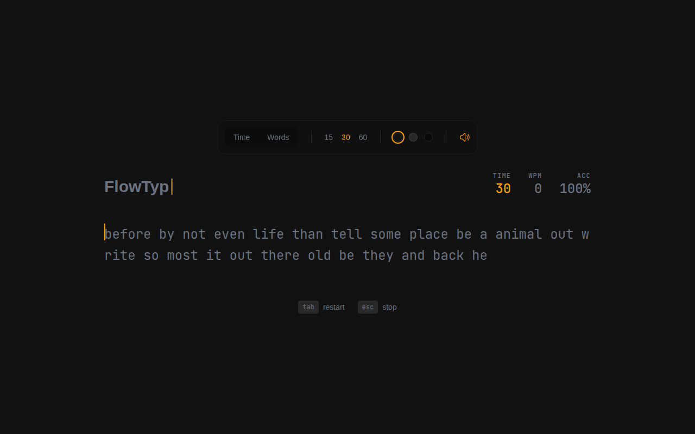
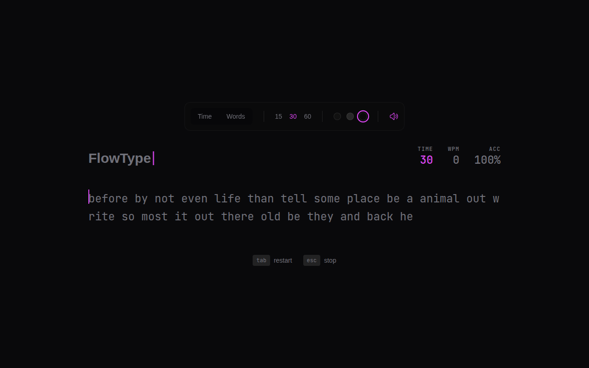
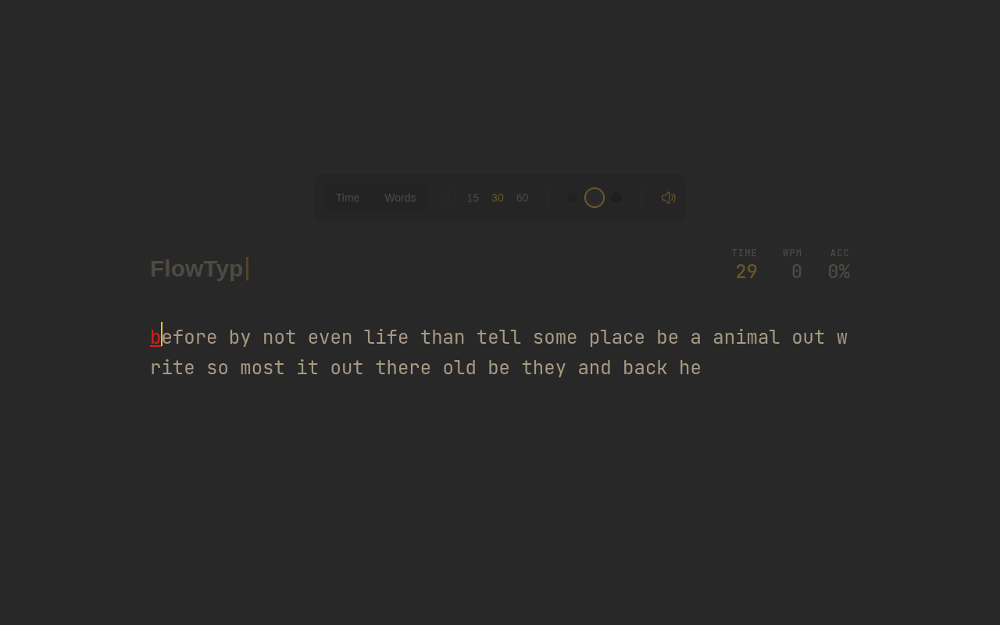
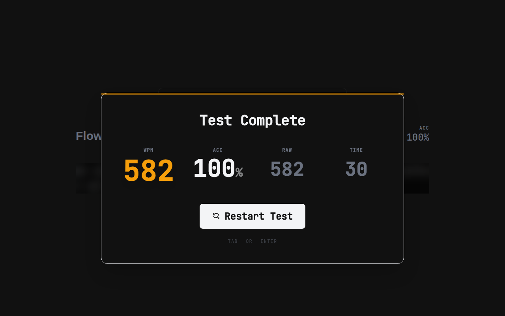

# FlowType ⚡


**FlowType** is a minimalist, aesthetic typing speed racer designed to help you enter the flow state. It combines premium visuals, satisfying mechanical sound feedback, and competitive features to make typing practice addictive.

## ✨ Features

- **👻 Ghost Racer**: Race against your own previous best! A ghost cursor replays your last run's speed real-time.
- **🧘 Zen Mode**: UI elements fade away while typing for zero distractions.
- **🎨 Dynamic Themes**: 
  - **Comfy**: Warm, Gruvbox-inspired tones for late-night sessions.
  - **Cyber**: High-contrast neon aesthetics for high-performance vibes.
- **🔊 Thocky Audio**: Deep, satisfying mechanical keyboard sounds on every keypress.
- **⚡ QoL Focused**: 
  - "Click to Focus" protection.
  - Screen shake on errors.
  - Smooth caret animations (framer-motion).
  - Smart Caps Lock detection.

## 🛠️ Tech Stack

- **Frontend**: React 18, Framer Motion, Tailwind CSS
- **Backend**: Laravel 11 (API Mode)
- **Database**: SQLite / MySQL
- **Build Tool**: Vite

## 🚀 Installation

### Prerequisites
- PHP 8.2+
- Node.js 20+
- Composer

### Setup

1. **Clone the repository**
   ```bash
   git clone https://github.com/Eustakius/FlowType.git
   cd FlowType
   ```

2. **Install Backend Dependencies**
   ```bash
   composer install
   cp .env.example .env
   php artisan key:generate
   ```

3. **Configure Database**
   Edit `.env` and set `DB_CONNECTION=sqlite` (or your preferred DB).
   ```bash
   touch database/database.sqlite
   php artisan migrate
   ```

4. **Install Frontend Dependencies**
   ```bash
   npm install
   ```

5. **Run Development Server**
   Open two terminals:
   ```bash
   # Terminal 1
   php artisan serve
   
   # Terminal 2
   npm run dev
   ```

## 📸 Screenshots

## 📸 Screenshots

| **Zen Mode & Comfy Theme** | **Cyber Theme** |
|:---:|:---:|
|  |  |
| **Active Typing (Zen)** | **Result Card** |
|  |  |

## 🤝 Contributing

Pull requests are welcome. For major changes, please open an issue first to discuss what you would like to change.

## 📄 License

[MIT](https://choosealicense.com/licenses/mit/)
